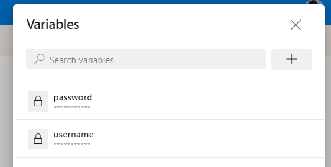
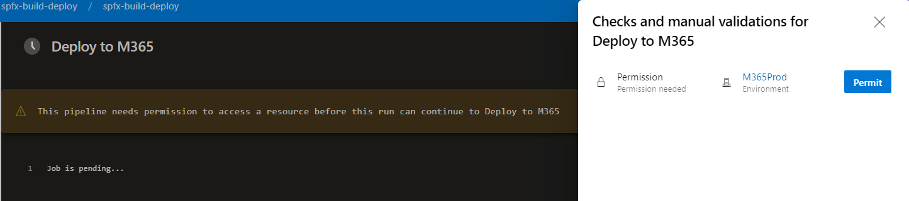
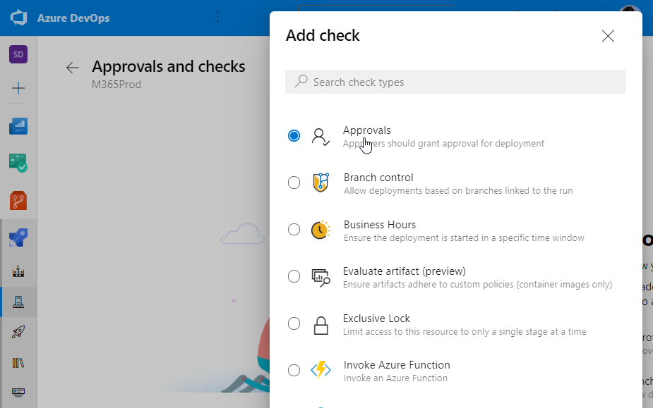

# SPFX DevOps

Sample Repo to demonstrate SPFx DevOps with approval and templates

## Demos 

Import `spfx-build-deploy.yml` into your DevOps Organization

Set runtime vars for username and password:

  

Assign envrionment permissions:

  

Configure approval:

  

Implement approval:

  