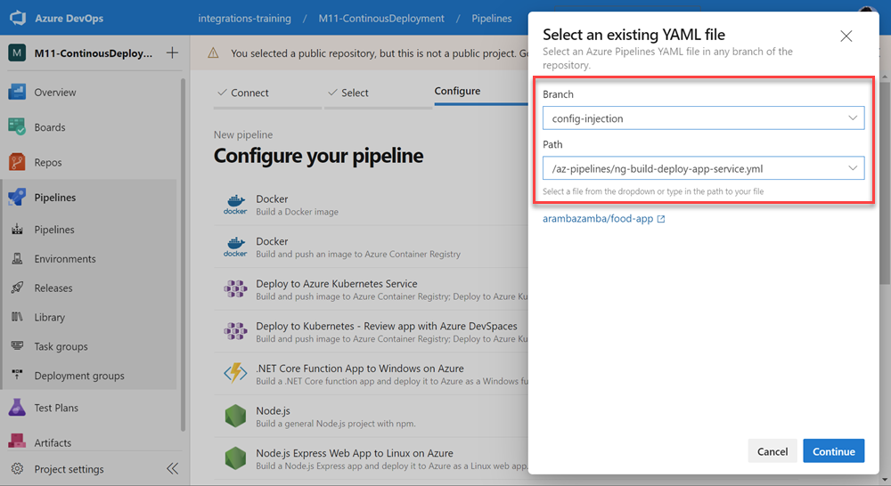

# Using File Transforms and Caching

The transformation and substitution options are:

- XML transformation
- XML variable substitution
- JSON variable substitution

[File transforms and variable substitution reference](https://docs.microsoft.com/en-us/azure/devops/pipelines/tasks/transforms-variable-substitution?view=azure-devops&tabs=Classic)

[Pipeline caching](https://docs.microsoft.com/en-us/azure/devops/pipelines/release/caching?view=azure-devops)

## Demo

Show pipeline [ng-build-deploy-app-service-file-transform.yml](https://github.com/arambazamba/food-app/blob/config-injection/az-pipelines/ng-build-deploy-app-service-file-transform.yml) of latest commit from branch `config-injection`. 



It uses `app-config.json` located in assets to inject a config using a `config-service.ts`. 

`app-config.json`:
```json
{
  "apiUrl": "https://localhost:5001/",
  "applicationInsights": "a196d36f-1782-4da4-8f95-a80585361df7",
  "azure": {
    "clientId": "fb9e23e2-7727-40a3-9515-7f53d90c6cab",
    "authority": "https://login.microsoftonline.com/d92b247e-90e0-4469-a129-6a32866c0d0a/",
    "redirectUri": "http://localhost:4200/"
  }
}
```

`config-service.ts`:
```typescript
@Injectable({
  providedIn: 'root',
})
export class ConfigService {
  cfgInit: BehaviorSubject<boolean> = new BehaviorSubject<boolean>(false);

  constructor(private client: HttpClient) {
    this.initConfig();
  }

  initConfig() {
    this.client.get<AppConfig>('assets/app-config.json').subscribe((cfg) => {
      this.cfgInit.next(true);
    });
  }

  //static used in app.module.ts
  static appInitFactory(configsrv: ConfigService) {
    return () => configsrv;
  }
}
```

The `apiUrl` value is overwritte by the `FileTransform`:

```yaml
variables:
  ...
  apiurl: 'https://foodapi-$(env).azurewebsites.net/'
  ...
    - task: FileTransform@1
                displayName: Replace Api Url
                inputs:
                folderPath: '$(System.DefaultWorkingDirectory)/**/assets'
                fileType: 'json'
                targetFiles: '**/app-config.json'
```
>Note: The current state of `food-ui` injects environment variables to override config values. As this is `TypeScript` and NOT `json`, `FileTransforms` would not work here. Instead you would use the [Tokenizing Angular Environment Configuration](https://josh-ops.com/posts/angular-tokenization/) approach

```typescript
export const environment = {
  production: true,
  authEnabled: window['env'].authEnabled,
  apiUrl: window['env'].apiUrl,
  azure: {
    applicationInsights: window['env'].applicationInsights,
    signalREndpoint: window['env'].signalREndpoint,
    appReg: {
      clientId: window['env'].clientId,
      authority: window['env'].authority,
      redirectUri: window['env'].redirectUri,
      scopes: window['env'].scopes,
    },
  },
  features: {
    reactive: window['env'].reactive,
  },
};
```