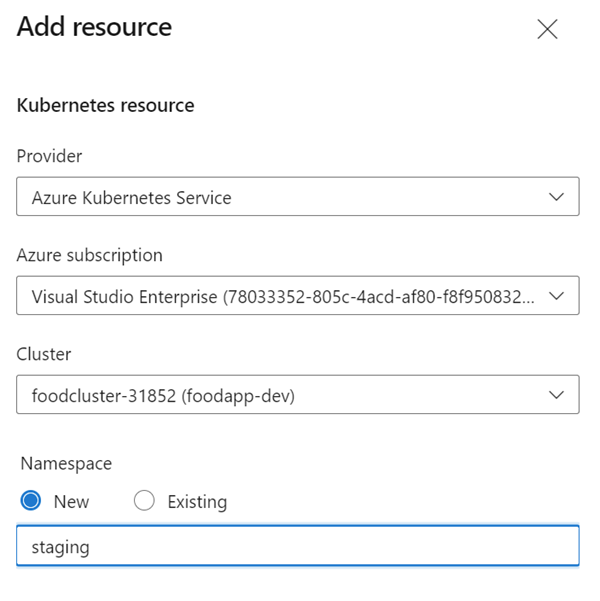

# Build an image and deploy it to a Kubernetes cluster using Azure DevOps pipelines

## Api

- Create a connection to ACR
- Explain [api-build-deploy-k8s.yml](https://github.com/arambazamba/food-app/blob/master/az-pipelines/api-build-deploy-k8s.yml)
- Create a Kubernetes ressource with implicit Kubernetes Service Connection in environment `foodapp-staging`
   
- Run pipeline

## UI

- Explain [ng-build-deploy-k8s.yml](https://github.com/arambazamba/food-app/blob/master/az-pipelines/ng-build-deploy-k8s.yml)
- Run pipeline
