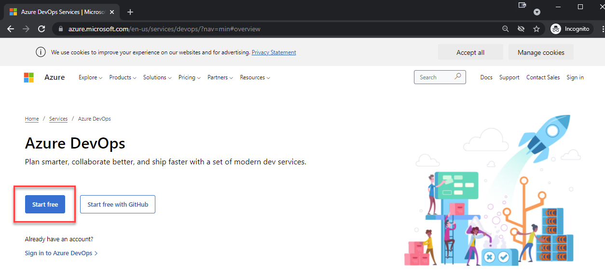
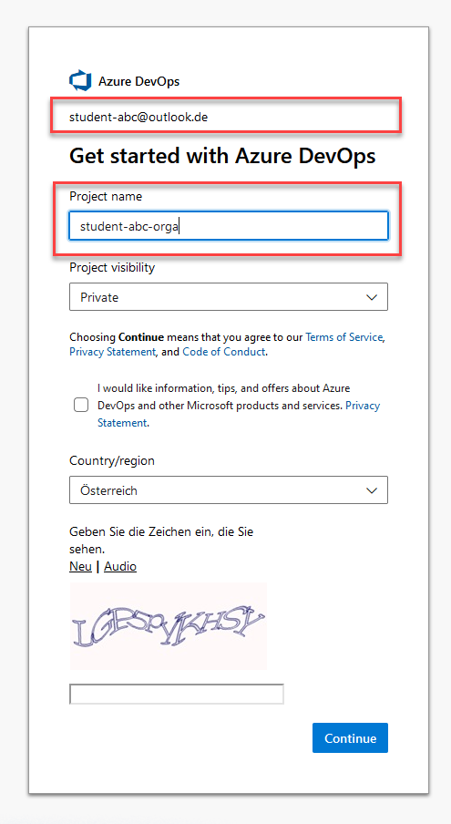

# Azure DevOps Organisation

Go to [http://dev.azure.com](http://dev.azure.com) to register your Azure DevOps Organisation

Create your DevOps organisation. This will also the name of your first project:

Due to a ressource shortage explained [here](https://docs.microsoft.com/en-us/azure/devops/pipelines/licensing/concurrent-jobs?view=azure-devops&tabs=ms-hosted) you have to request free build minutes for Microsoft hosted agents

Fill out the [request](https://aka.ms/azpipelines-parallelism-request) to get the grant for free agent build minutes:

You can check the grant at: `https://dev.azure.com/<DEVOPS-ORGA>/_settings/buildqueue?_a=concurrentJobs`

>Note: As an alternative you can use your own Azure Hosted Agents which will be covered in Module 04