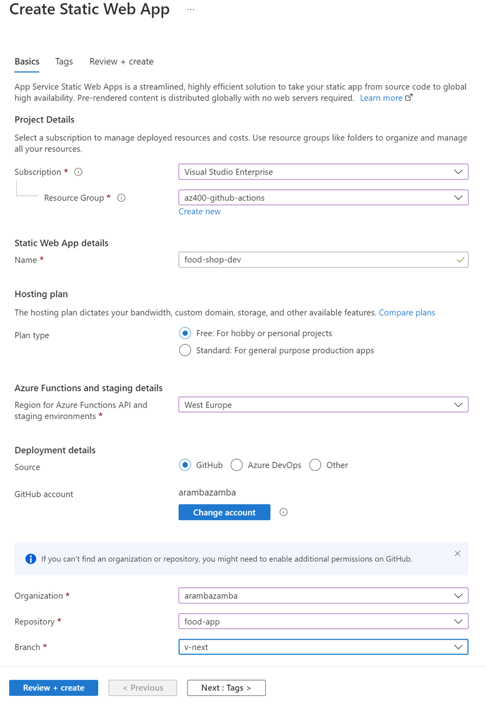

# Azure Static Web App / Angular Continuous Integration

[Azure Static Web Apps](https://learn.microsoft.com/en-us/azure/static-web-apps/)

[az staticwebapp](https://learn.microsoft.com/en-us/cli/azure/staticwebapp?view=azure-cli-latest)

## Demo

- Create Static Web App using Azure Portal

    

- Use the following Angular build details:

    

## Scripted provisioning

 - You can also create Static Web App using Azure CLI by executing `create-static-webapp.azcli`. 

- For automation in a pipeline you can also use token based authentication

- Set the access token for Github in terminal using: gittoken=YOUR-TOKEN

    ```bash
    az staticwebapp create -n $app -g $grp -s $repo -l $loc -b master --app-location "apps/shop-ui/" --output-location "dist/food-shop-ui" --token $gittoken
    ```

    >Note: Before excuting the script set an GitHub acces token in your environment using: [Creating a personal access token](https://docs.github.com/en/authentication/keeping-your-account-and-data-secure/creating-a-personal-access-token)    