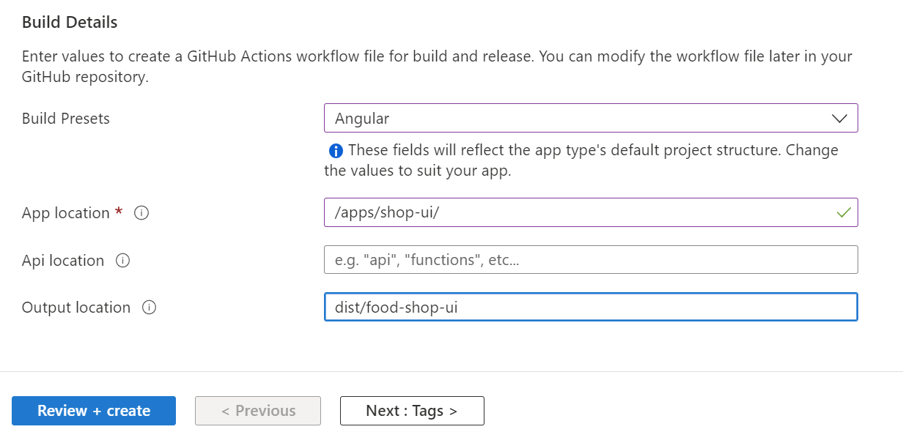

# Azure Static Web App / Angular Continuous Integration

[Azure Static Web Apps](https://docs.microsoft.com/en-us/azure/static-web-apps/)

[az staticwebapp](https://docs.microsoft.com/en-us/cli/azure/staticwebapp?view=azure-cli-latest)

## Demo

- Create Static Web App using Azure Portal

    

- Use the following Angular build details:

    

- Explain the details of catalog-api-cicd.yml    