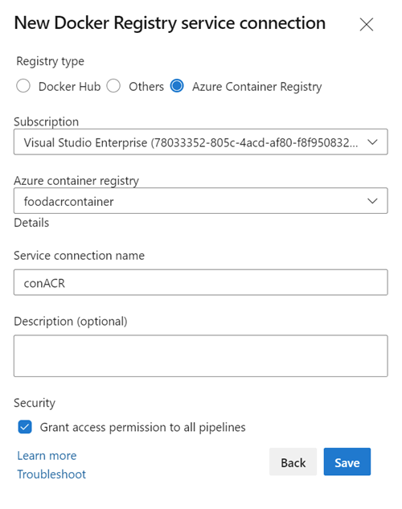

# Azure Container Registry & Build

[Azure Container Registry](https://docs.microsoft.com/en-us/azure/container-registry/)

## Demo

### Build Container Image & Upload to ACR

Execute `manual-build-upload.azcli` and upload img manually:

```bash
...
docker tag foodui $acr.azurecr.io/foodui
docker push $acr.azurecr.io/foodui
```

[Automate container image builds and maintenance with ACR Tasks](https://docs.microsoft.com/en-us/azure/container-registry/container-registry-tasks-overview)

## Build Container Image & using ACR Task

Execute `acr-task.azcli` in folder `food-ui` to execute build using Azure Container Registry task.

Explain Docker Service Connection:



Show pipeline [catalog-ci-docker-img.yml](https://github.com/arambazamba/food-app/blob/master/deploy/az-pipelines/catalog-ci-docker-img.yml)