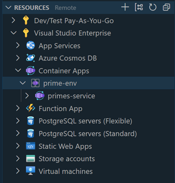
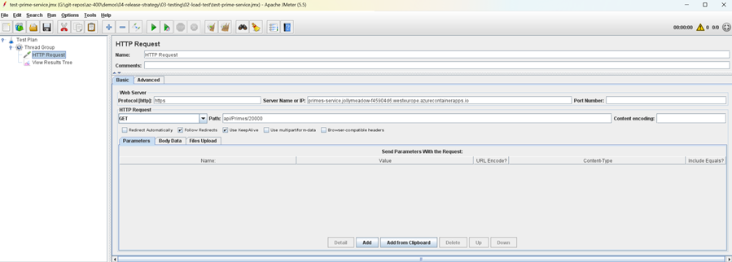
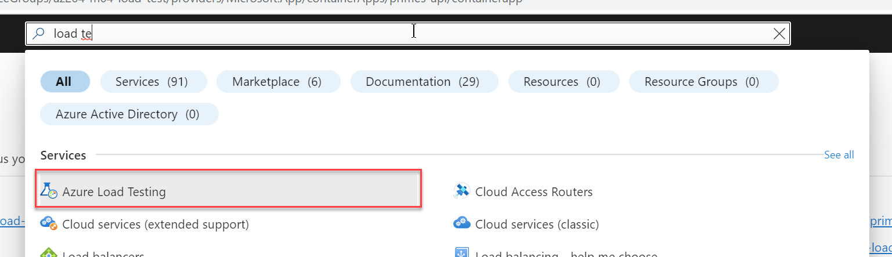
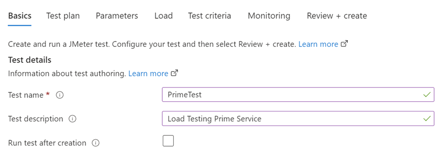
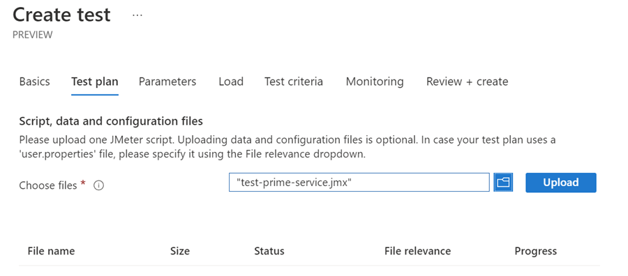
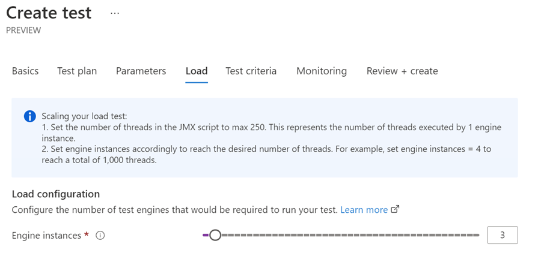
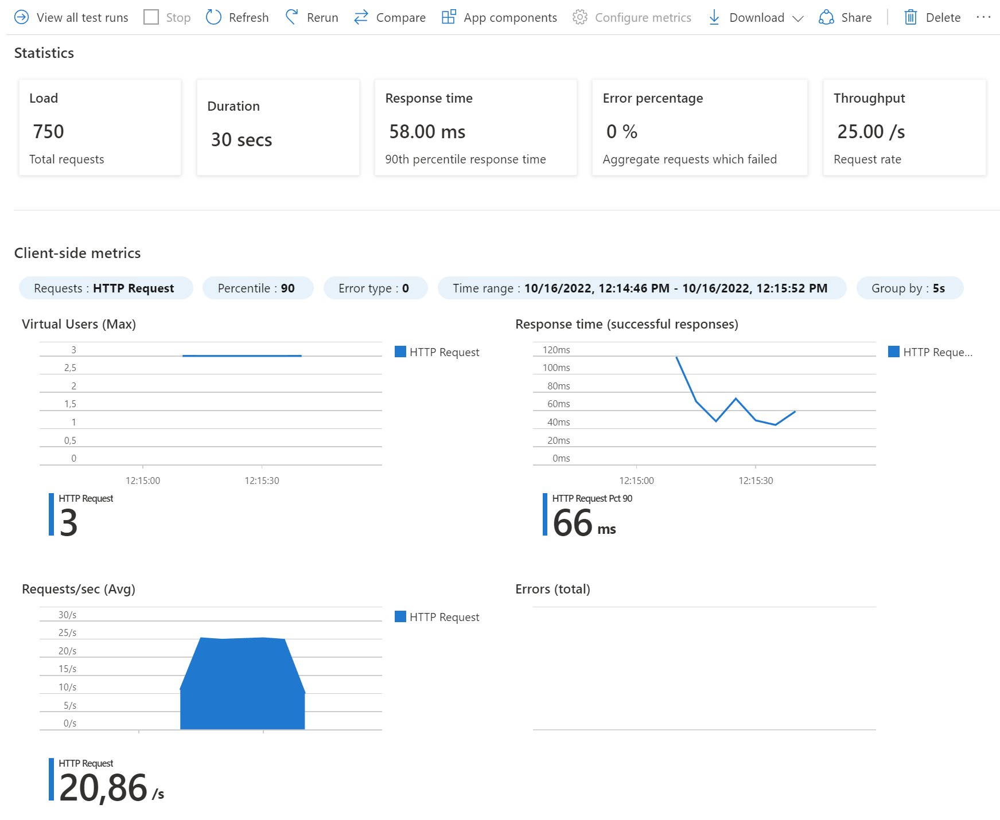

# Load testing

- PrimesService gets the count of prime numbers up to a given number and returns the time taken. It also contains a dockerfile to build a docker image which has been published to [Docker Hub](https://hub.docker.com/repository/docker/arambazamba/primesservice):

    ```c#
    [HttpGet]
    [Route("{n}")]
    public IActionResult Get(int n)
    {
        Stopwatch watch = new Stopwatch();
        watch.Start();
        var count = getPrimesCount(n);
        watch.Stop();
        return Ok($"Primes - {count}, Time Taken - {watch.ElapsedMilliseconds}ms, Instance Id - {Environment.GetEnvironmentVariable("WEBSITE_INSTANCE_ID")}");
    }
    ```

- Deploy `PrimesService` to [Azure Container Apps](https://learn.microsoft.com/en-us/azure/container-apps/) using the Visual Studio Code [Container Apps Extension](https://marketplace.visualstudio.com/items?itemName=ms-azuretools.vscode-azurecontainerapps) or execute `create-prime-service.ps1`.

    

- Test the service using the following command:

    ```bash
    curl https://primes-api.kindplant-307af914.westeurope.azurecontainerapps.io/api/primes/10000
    ```    

    > Note: The url is taken from the container app overview. Add `/api/primes/10000` to the url.

- Install [Apache JMeter](https://jmeter.apache.org/) and requirements:

    ```powershell
    choco install jdk8 -y
    choco install jmeter -y
    ```

- Create a new JMeter test plan by importing the `jmeter-test-plan.jmx` into the JMeter GUI. Update with the URL of the the container app.

        

- Update the URL in the JMeter test plan according to your URL and save the test plan.

    ```bash
    primes-api.kindplant-307af914.westeurope.azurecontainerapps.io
    ```

- Create a load testing instance in Azure by searching for it in the horicontal search bar and the choosing `Create`. Accept all defaults.

    

- Create a test by choosing "Upload JMeter script"

    

    

    

- Execute the test and examine the result   

    