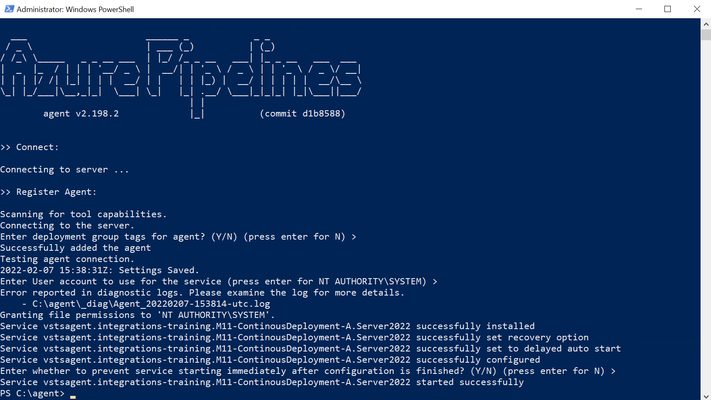
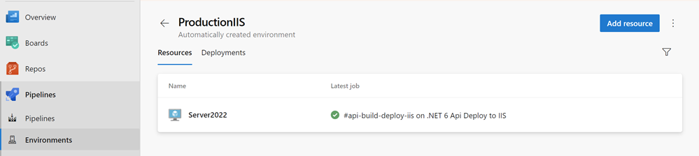
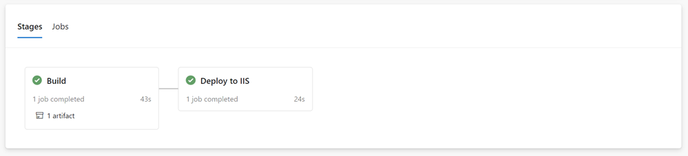

# Using Deployment Groups to deploy to IIS

[Provision deployment groups](https://docs.microsoft.com/en-us/azure/devops/pipelines/process/deployment-jobs?view=azure-devops)


## Demos

Execute `create-deployment-vm.azcli` to create a vm to deploy to

Ensure that requirements are installed. To install all feature use an elevated PowerShell prompt and execute `install-sw.ps1`:

```powershell
Set-ExecutionPolicy Bypass -Scope Process -Force; 
[System.Net.ServicePointManager]::SecurityProtocol = [System.Net.ServicePointManager]::SecurityProtocol -bor 3072; 
Invoke-Expression ((New-Object System.Net.WebClient).DownloadString('https://chocolatey.org/install.ps1'))

Get-WindowsOptionalFeature -Online | where FeatureName -like 'IIS-*'

choco install dotnet-6.0-runtime -y
choco install dotnet-6.0-windowshosting -y

Restart-Computer -ComputerName localhost -Force
```

Create a deployment group. Copy Script. It contains an access token:


>Note: You can also use the vm from module 04 or install the agent using choco:

Complete the agent config on the VM:

```PowerShell
cd \agent
...
.\config.cmd --deploymentgroup --deploymentgroupname "Azure-Webserver" --agent $env:COMPUTERNAME --runasservice --work '_work' \
--url 'https://dev.azure.com/integrations-training/' \
--projectname 'M11-ContinousDeployment' --auth PAT --token exaymaqys....
```



Inspect Environment and Virtual Machine Ressource:



Check the agent:


Import `catalog-api-build-deploy-iis.yaml` adjust variables and execute pipeline:

